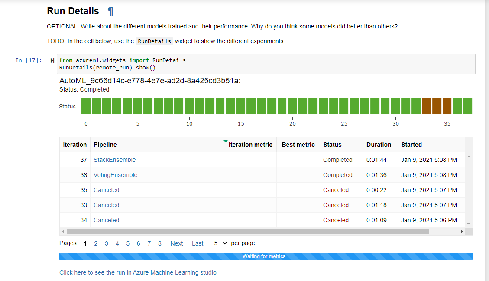
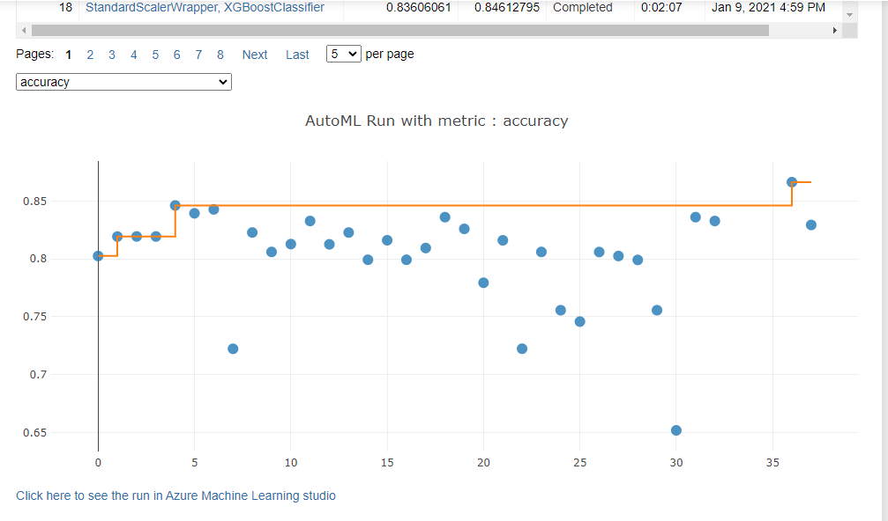
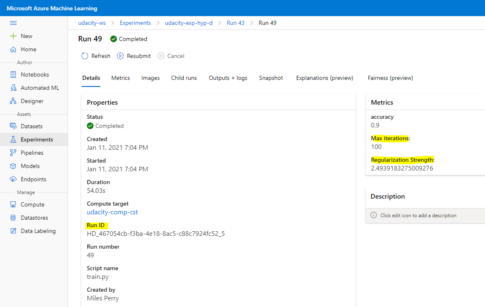
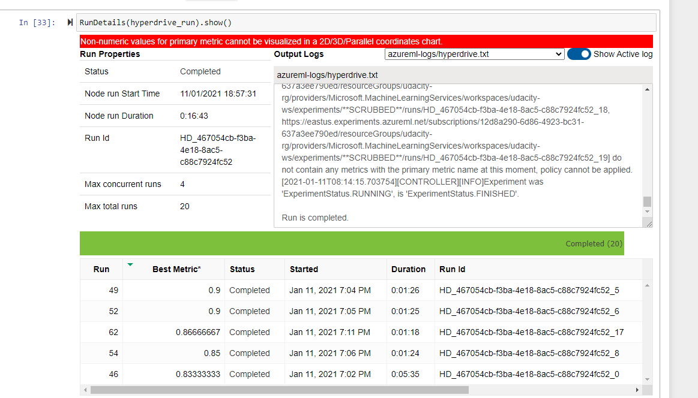
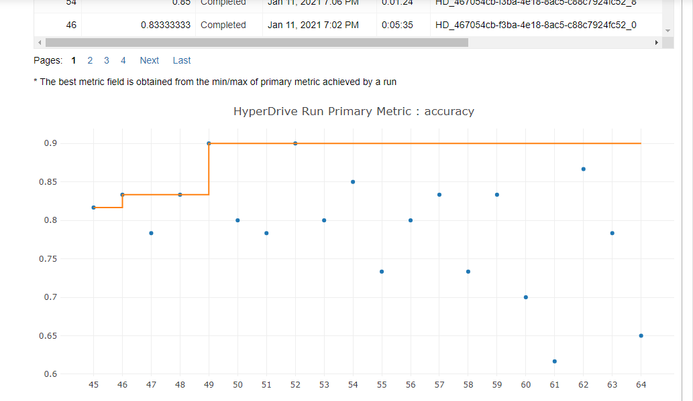
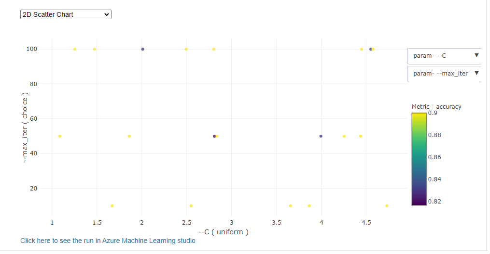
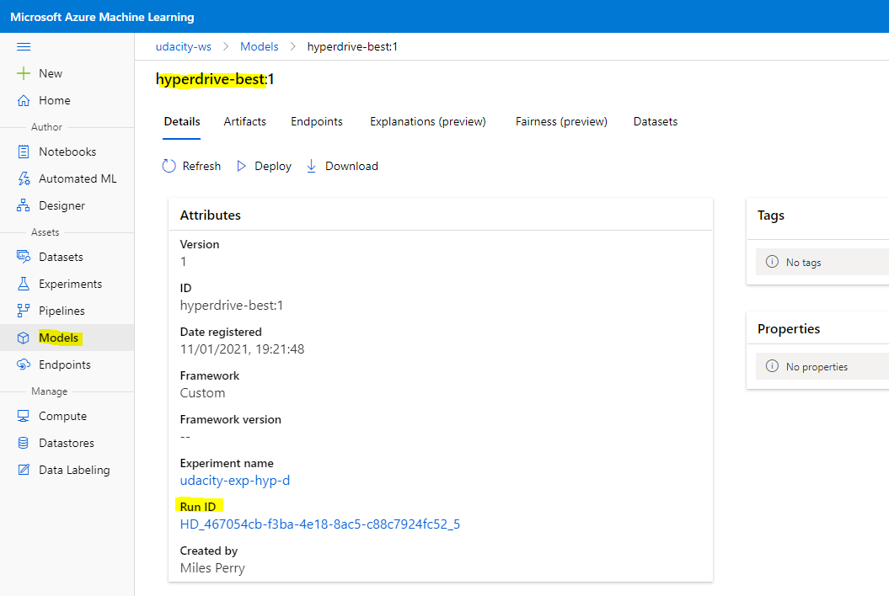
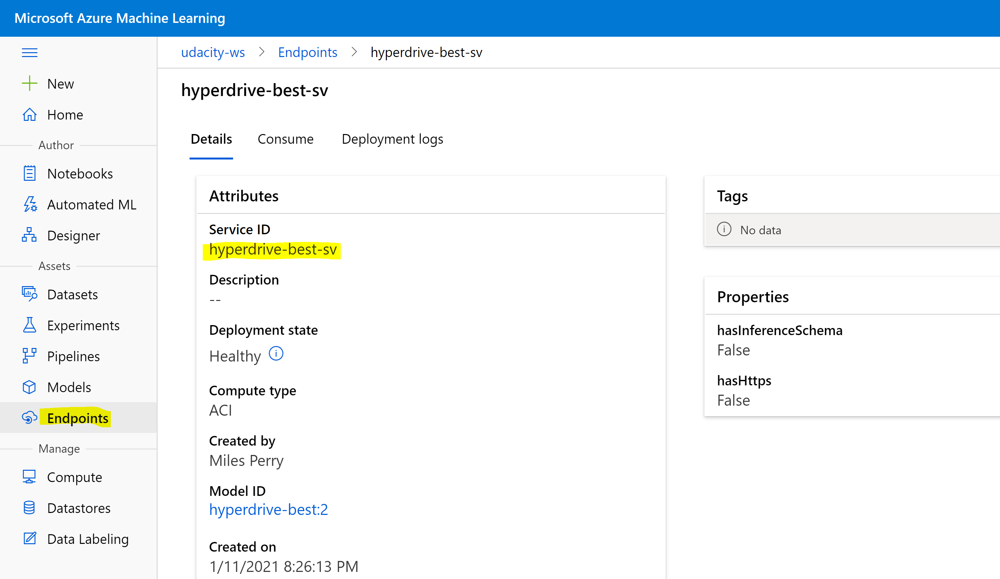
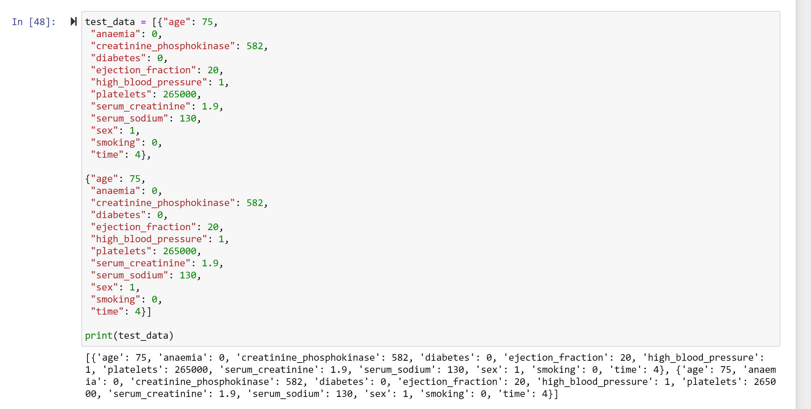
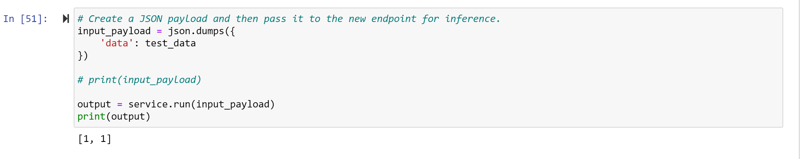

*NOTE:* This file is a template that you can use to create the README for your project. The *TODO* comments below will highlight the information you should be sure to include.

# CAPSTONE PROJECT - AZURE MACHINE LEARNING ENGINEER

*TODO:* Write a short introduction to your project.

The aim of this project is to run both an Automated ML experiment and a customised experiment with hyperparameters tuned using the HyperDrive feature.
The best model from each experiment will be evaluated and the best overall model will be deployed as an endpoint and queried via the Python SDK.

The dataset used for this project was the Heart Failure Clinical Dataset from Kaggle https://www.kaggle.com/andrewmvd/heart-failure-clinical-data. Based on the features in the dataset the aim of the experiment was to predict if the patient had a death event in the follow up period.

For the customised experiment a Logistic Regression classifier was used. The best overall model was the Logistic Regression model with 90% accuracy on the test data. The Automated ML best model was only 86.6% accuarate. The Logistic Regression model was then deployed as a web service.

## Project Set Up and Installation
*OPTIONAL:* If your project has any special installation steps, this is where you should put it. To turn this project into a professional portfolio project, you are encouraged to explain how to set up this project in AzureML.

The following steps were taken to set up this project:
1. Create a new Azure ML workspace.
2. Create a compute instance on which to run Jupyter Notebook. STANDARD_DS2_V2 was chosen.
3. Create a compute cluster for training. STANDARD_DS12_V2, max 4 nodes, min 0 nodes, with low priority status was chosen.
4. The Kaggle dataset was uploaded to the workspace as a registered dataset.
5. The Automated ML experiment was executed using the notebook /automl.ipynb. Details:
	5.1 Load the workspace, dataset and create a new experiment.
	5.2 Load the compute cluster.
	5.3 Define the Automated ML settings and configuration.
	5.4 Submit the experiment.
	5.5 Execute the RunDetails widget to see the output from each iteration.
	5.6 The best model was examined.
6. The HyperDrive experiment was executed using the notebook /hyperparameter_tuning.ipynb. Details:
	6.1 Load the workspace, dataset and create a new experiment.
	6.2 Load the compute cluster.
	6.3 Define an early termination policy.
	6.4 Define the parameters and the sampling type.
	6.5 Define an environment for training.
	6.6 Define the ScriptRunConfig and HyperDriveConfig for training.
	6.7 Submit the experiment.
	6.8 Execute the RunDetails widget to see the output from each iteration.
	6.9 The best model was examined and the model file saved.
	6.10 The best model was regsitered in the workspace.
	6.11 Inference and deployment config were defined for the endpoint.
	6.12 The model was deployed.
	6.13 Application Insights was enabled on the endpoint.
	6.14 A JSON payload was sent to the end point to test it.
	6.15 Service logs for the endpoint were retrieved.
7. This README.md file was created.
8. A screencast was recorded outlining the key points of the project.

## Dataset

### Overview
*TODO*: Explain about the data you are using and where you got it from.

For this experiment I will be using Azure AutoML to make predictions regarding the likelihood of a death event based on a patient's features as found in the Heart Failure Prediction dataset on Kaggle. https://www.kaggle.com/andrewmvd/heart-failure-clinical-data

### Task
*TODO*: Explain the task you are going to be solving with this dataset and the features you will be using for it.

Features and target (DEATH_EVENT) of the Heart Failure Prediction data set are:

* "age": Age of patient
* "anaemia": Decrease of red blood cells or hemoglobin (boolean)
* "creatinine_phosphokinase": Level of the CPK enzyme in the blood (mcg/L)
* "diabetes": If the patient has diabetes (boolean)
* "ejection_fraction": Percentage of blood leaving the heart at each contraction (percentage)
* "high_blood_pressure": If the patient has hypertension (boolean)
* "platelets": Platelets in the blood (kiloplatelets/mL)
* "serum_creatinine": Level of serum creatinine in the blood (mg/dL)
* "serum_sodium": Level of serum sodium in the blood (mEq/L)
* "sex": Woman or man (binary)
* "smoking": If the patient smokes or not (boolean)
* "time": Follow-up period (days)
* "DEATH_EVENT": If the patient deceased during the follow-up period (boolean)

Using the above features columns I will attempt to predict the DEATH_EVENT column i.e. the likelihood of a death event based on a patient's features.

### Access
*TODO*: Explain how you are accessing the data in your workspace.

The data was registered in the workspace as a dataset. It was then pulled into the Jupyter Notebook using the Dataset class of the Azure ML Python SDK.

## Automated ML
*TODO*: Give an overview of the `automl` settings and configuration you used for this experiment

An overview of the Automated ML settings and configuration I used is below:

* "n_cross_validations": I used 3 so that 3 different cross validation trainings were performed, each using 2/3 of the available data. For my small dataset and demostration purposes this value was ok. For larger datasets I would go go a higher number so that we get more data used in training and a smaller validation set.
* "primary_metric": For this experiment accuracy is a suitable metric for classification task.
* "enable_early_stopping": This will end the experiment is primary_metric is not improving, which will save me time waiting for experiment to end.  
* "experiment_timeout_hours": If expeirment takes more than 1 hour it will timeout. This is to avoid length experiments running unnecessarily.
* "max_concurrent_iterations": This is the max number of concurrent iterations of the expeirment. I set it to 4 as 1 iteration can run on 1 node of the compute cluster, which has 4 nodes.
* "max_cores_per_iteration": The max number of cpu threads to use for an iteration. I set this to -1 so as to use all available threads.
* "iteration_timeout_minutes": This is the timeout for each iteration. I set this to 15 minutes as I was not interested in anything take longer than this to run for my current experiment.
* "verbosity": I choose default the level of logging for my experiment. 
* "iterations": I set the maximum number of iterations for AutoML to run to be 40. This seemed like a reasonable number of iterations for the course without taking up too much time and compute on the Azure platform. 
* "task": The task is to predict a death event which is a classification task (yes/no).
* "compute_target": I set this to my computer cluster that I created earlier in the notebook.
* "training_data": This was set to the dataset that I loaded earlier.
* "label_column_name": This was set to the column DEATH_EVENT in the imported dataset. It is the column we wish to predict.

### Results
*TODO*: What are the results you got with your automated ML model? What were the parameters of the model? How could you have improved it?

*TODO* Remeber to provide screenshots of the `RunDetails` widget as well as a screenshot of the best model trained with it's parameters.

The best model from the Automated ML experiment was a Voting Ensemble. The paramters can bee seen below:

datatransformer
{'enable_dnn': None,
 'enable_feature_sweeping': None,
 'feature_sweeping_config': None,
 'feature_sweeping_timeout': None,
 'featurization_config': None,
 'force_text_dnn': None,
 'is_cross_validation': None,
 'is_onnx_compatible': None,
 'logger': None,
 'observer': None,
 'task': None,
 'working_dir': None}

prefittedsoftvotingclassifier
{'estimators': ['4', '6', '5', '31', '18', '8', '21', '26', '29'],
 'weights': [0.09090909090909091,
             0.09090909090909091,
             0.09090909090909091,
             0.09090909090909091,
             0.09090909090909091,
             0.2727272727272727,
             0.09090909090909091,
             0.09090909090909091,
             0.09090909090909091]}

4 - minmaxscaler
{'copy': True, 'feature_range': (0, 1)}

4 - randomforestclassifier
{'bootstrap': True,
 'ccp_alpha': 0.0,
 'class_weight': 'balanced',
 'criterion': 'gini',
 'max_depth': None,
 'max_features': 'log2',
 'max_leaf_nodes': None,
 'max_samples': None,
 'min_impurity_decrease': 0.0,
 'min_impurity_split': None,
 'min_samples_leaf': 0.01,
 'min_samples_split': 0.01,
 'min_weight_fraction_leaf': 0.0,
 'n_estimators': 25,
 'n_jobs': -1,
 'oob_score': True,
 'random_state': None,
 'verbose': 0,
 'warm_start': False}

6 - standardscalerwrapper
{'class_name': 'StandardScaler',
 'copy': True,
 'module_name': 'sklearn.preprocessing._data',
 'with_mean': False,
 'with_std': False}

6 - xgboostclassifier
{'base_score': 0.5,
 'booster': 'gbtree',
 'colsample_bylevel': 1,
 'colsample_bynode': 1,
 'colsample_bytree': 0.8,
 'eta': 0.01,
 'gamma': 0,
 'grow_policy': 'lossguide',
 'learning_rate': 0.1,
 'max_bin': 255,
 'max_delta_step': 0,
 'max_depth': 6,
 'max_leaves': 3,
 'min_child_weight': 1,
 'missing': nan,
 'n_estimators': 10,
 'n_jobs': -1,
 'nthread': None,
 'objective': 'reg:logistic',
 'random_state': 0,
 'reg_alpha': 0.3125,
 'reg_lambda': 1.6666666666666667,
 'scale_pos_weight': 1,
 'seed': None,
 'silent': None,
 'subsample': 0.6,
 'tree_method': 'hist',
 'verbose': -10,
 'verbosity': 0}

5 - robustscaler
{'copy': True,
 'quantile_range': [25, 75],
 'with_centering': False,
 'with_scaling': True}

5 - lightgbmclassifier
{'boosting_type': 'goss',
 'class_weight': None,
 'colsample_bytree': 0.7922222222222222,
 'importance_type': 'split',
 'learning_rate': 0.005272631578947368,
 'max_bin': 160,
 'max_depth': 7,
 'min_child_samples': 19,
 'min_child_weight': 0,
 'min_split_gain': 0.2631578947368421,
 'n_estimators': 800,
 'n_jobs': -1,
 'num_leaves': 239,
 'objective': None,
 'random_state': None,
 'reg_alpha': 0.5263157894736842,
 'reg_lambda': 0.10526315789473684,
 'silent': True,
 'subsample': 1,
 'subsample_for_bin': 200000,
 'subsample_freq': 0,
 'verbose': -10}

31 - maxabsscaler
{'copy': True}

31 - lightgbmclassifier
{'boosting_type': 'gbdt',
 'class_weight': None,
 'colsample_bytree': 0.7922222222222222,
 'importance_type': 'split',
 'learning_rate': 0.05263631578947369,
 'max_bin': 90,
 'max_depth': 7,
 'min_child_samples': 8,
 'min_child_weight': 5,
 'min_split_gain': 0.10526315789473684,
 'n_estimators': 50,
 'n_jobs': -1,
 'num_leaves': 176,
 'objective': None,
 'random_state': None,
 'reg_alpha': 0.7368421052631579,
 'reg_lambda': 0.47368421052631576,
 'silent': True,
 'subsample': 0.8415789473684211,
 'subsample_for_bin': 200000,
 'subsample_freq': 0,
 'verbose': -10}

18 - standardscalerwrapper
{'class_name': 'StandardScaler',
 'copy': True,
 'module_name': 'sklearn.preprocessing._data',
 'with_mean': False,
 'with_std': False}

18 - xgboostclassifier
{'base_score': 0.5,
 'booster': 'gbtree',
 'colsample_bylevel': 1,
 'colsample_bynode': 1,
 'colsample_bytree': 0.7,
 'eta': 0.3,
 'gamma': 0,
 'grow_policy': 'lossguide',
 'learning_rate': 0.1,
 'max_bin': 1023,
 'max_delta_step': 0,
 'max_depth': 2,
 'max_leaves': 0,
 'min_child_weight': 1,
 'missing': nan,
 'n_estimators': 10,
 'n_jobs': -1,
 'nthread': None,
 'objective': 'reg:logistic',
 'random_state': 0,
 'reg_alpha': 0.9375,
 'reg_lambda': 1.0416666666666667,
 'scale_pos_weight': 1,
 'seed': None,
 'silent': None,
 'subsample': 1,
 'tree_method': 'hist',
 'verbose': -10,
 'verbosity': 0}

8 - sparsenormalizer
{'copy': True, 'norm': 'l2'}

8 - xgboostclassifier
{'base_score': 0.5,
 'booster': 'gbtree',
 'colsample_bylevel': 1,
 'colsample_bynode': 1,
 'colsample_bytree': 0.5,
 'eta': 0.1,
 'gamma': 0,
 'learning_rate': 0.1,
 'max_delta_step': 0,
 'max_depth': 6,
 'max_leaves': 15,
 'min_child_weight': 1,
 'missing': nan,
 'n_estimators': 100,
 'n_jobs': -1,
 'nthread': None,
 'objective': 'reg:logistic',
 'random_state': 0,
 'reg_alpha': 0,
 'reg_lambda': 2.0833333333333335,
 'scale_pos_weight': 1,
 'seed': None,
 'silent': None,
 'subsample': 1,
 'tree_method': 'auto',
 'verbose': -10,
 'verbosity': 0}

21 - sparsenormalizer
{'copy': True, 'norm': 'l1'}

21 - xgboostclassifier
{'base_score': 0.5,
 'booster': 'gbtree',
 'colsample_bylevel': 1,
 'colsample_bynode': 1,
 'colsample_bytree': 0.7,
 'eta': 0.2,
 'gamma': 0,
 'learning_rate': 0.1,
 'max_delta_step': 0,
 'max_depth': 7,
 'max_leaves': 31,
 'min_child_weight': 1,
 'missing': nan,
 'n_estimators': 10,
 'n_jobs': -1,
 'nthread': None,
 'objective': 'reg:logistic',
 'random_state': 0,
 'reg_alpha': 0,
 'reg_lambda': 0.625,
 'scale_pos_weight': 1,
 'seed': None,
 'silent': None,
 'subsample': 1,
 'tree_method': 'auto',
 'verbose': -10,
 'verbosity': 0}

26 - minmaxscaler
{'copy': True, 'feature_range': (0, 1)}

26 - lightgbmclassifier
{'boosting_type': 'goss',
 'class_weight': None,
 'colsample_bytree': 0.5944444444444444,
 'importance_type': 'split',
 'learning_rate': 0.010535263157894737,
 'max_bin': 170,
 'max_depth': 9,
 'min_child_samples': 6,
 'min_child_weight': 4,
 'min_split_gain': 0.5263157894736842,
 'n_estimators': 100,
 'n_jobs': -1,
 'num_leaves': 77,
 'objective': None,
 'random_state': None,
 'reg_alpha': 0,
 'reg_lambda': 0.05263157894736842,
 'silent': True,
 'subsample': 1,
 'subsample_for_bin': 200000,
 'subsample_freq': 0,
 'verbose': -10}

29 - maxabsscaler
{'copy': True}

29 - extratreesclassifier
{'bootstrap': False,
 'ccp_alpha': 0.0,
 'class_weight': 'balanced',
 'criterion': 'entropy',
 'max_depth': None,
 'max_features': 0.05,
 'max_leaf_nodes': None,
 'max_samples': None,
 'min_impurity_decrease': 0.0,
 'min_impurity_split': None,
 'min_samples_leaf': 0.06157894736842105,
 'min_samples_split': 0.01,
 'min_weight_fraction_leaf': 0.0,
 'n_estimators': 600,
 'n_jobs': -1,
 'oob_score': False,
 'random_state': None,
 'verbose': 0,
 'warm_start': False}

The Voting Ensemble model was 86.6% accurate.

Ideas for improvement:
* Run the Automated ML for more iterations.
* I would like to change the number of cross validations and see how this effects the accuracy value for the different models.
* The data set is very small 300+ records. I would like to get more training data.

The RunDetails widget can bee seen below. This shows the status, duration and accuracy of each of the experiment iterations.

## Hyperparameter Tuning
*TODO*: What kind of model did you choose for this experiment and why? Give an overview of the types of parameters and their ranges used for the hyperparameter search

For the HyperDrive experiment I chose a Logistic Regression classifier. Given this was a classification problem with a 0 or 1 outcome this is suited to Logistic Regression. Also, given the small size of my data set I didn't see then need for anything too complex (e.g. DNN). As such I settled with the Logistic Regression.

The model training was perfromed by the 'train.py'file. The HyperDrive feature was used to pass the dataset( --data), a range of regularization strength (--C) values and a range of epoch (--max_iter) values to the 'train.py'file. The paramaters were chosen randomly from a uniform range between 1 and 5 for --C, and from a discrete set of values [10, 50, 100] for --max_iter.

The --max_iter value seemed like a good starting point for a small ML model. The values of --C were also starting point for this experiment. Smaller values of --C increase the regularization strength.

### Results
*TODO*: What are the results you got with your model? What were the parameters of the model? How could you have improved it?

*TODO* Remeber to provide screenshots of the `RunDetails` widget as well as a screenshot of the best model trained with it's parameters.

The best model was 90% accuracy. The value of --C was 2.4939 and --max_iter was 100. The best model run_id and metrics can bee seen below.

Ideas for improvement:
* Run the experiment for more iterations, e.g. 150, 200 and see the effect.
* Increase the regularisation to see if this has an effect on generalisation capability.
* The data set is very small 300+ records. I would like to get more training data.
* Try different sizes of mini batches to see if this affects the model.

The RunDetails widget can bee seen below. This shows the status, duration and accuracy of each of the experiment iterations.

## Model Deployment
*TODO*: Give an overview of the deployed model and instructions on how to query the endpoint with a sample input.

The best model was registered in the workspace and can be seen below:

The model was deployed as per the /hyperparameter_tuning.ipynb notebook. The endpoint in the workspace can be seen below:

A set of test data was created as in the below screenshot for loading to the endpoint.

The test data was loaded to the endpoint as in the below screenshot. The resulting predictions for a death event based on the features provided are [1,1].

## Screen Recording
*TODO* Provide a link to a screen recording of the project in action. Remember that the screencast should demonstrate:
- A working model
- Demo of the deployed  model
- Demo of a sample request sent to the endpoint and its response

## Standout Suggestions
*TODO (Optional):* This is where you can provide information about any standout suggestions that you have attempted.
